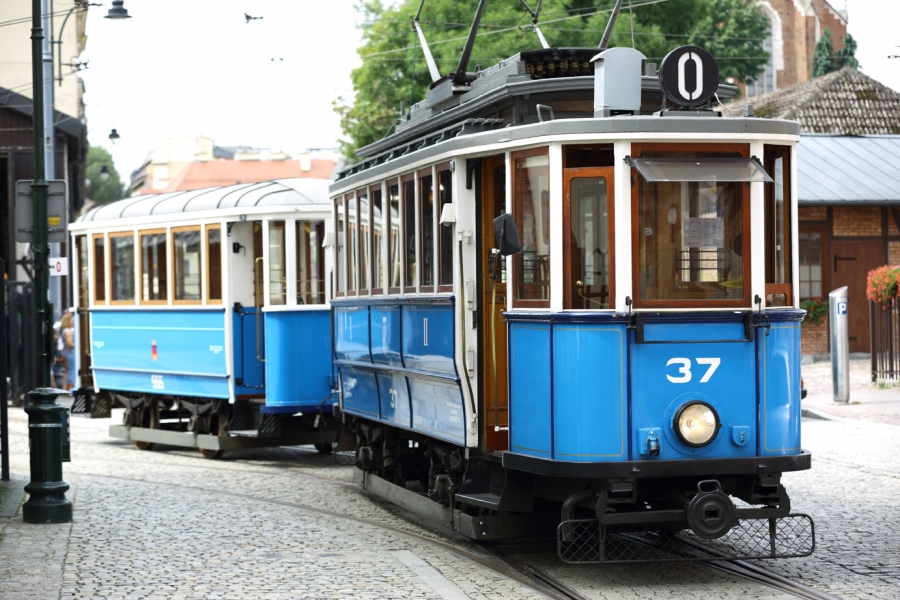

# Public-transport-in-Krakow

## TEAM

1. **Maksym Bykovets**
   - GitHub: [MaksymBykovets](https://github.com/MaksymBykovets)
   - Tasks: 5, 6
2. **Yuliia Kolomoitseva**
   - GitHub: [YuliiaKolomoitseva](https://github.com/YuliiaKolomoitseva)
   - Tasks: 1, 2
3. **Anastasiia Hrebennikova**
   - GitHub: [grebennikoovaa](https://github.com/grebennikoovaa)
   - Tasks: 3, 4

## INTRODUCTION
Public transport in Krakow is a vital component of the city’s infrastructure, enabling residents and visitors to travel affordably and sustainably. With a robust network of trams, buses, and suburban trains, the system efficiently connects diverse neighborhoods, the city center, and key tourist destinations. As Krakow has grown, so has its public transport system, adapting to meet the needs of a modern city. With increasing traffic and environmental challenges, Krakow’s transport network serves as both a solution to urban congestion and a means to reduce emissions, aligning with the city’s sustainability goals.

Krakow’s transport network is managed by the Municipal Transport Authority, which oversees planning, maintenance, and operations to ensure quality service. The tram system, one of the most widely used modes of transport, is especially popular for its speed, efficiency, and relatively low environmental impact. Buses complement the tram lines, covering routes not accessible by tram and reaching outer districts. By providing multiple transportation options, Krakow’s public transport is designed to meet the needs of the city's diverse population and millions of tourists each year.

In recent years, Krakow has introduced various modernization initiatives, including the adoption of eco-friendly buses and improved accessibility features. The city has invested in hybrid and electric buses, as well as the expansion of the tram network to accommodate more passengers while reducing pollution levels. The shift towards sustainable transit options demonstrates Krakow's commitment to environmental responsibility and quality of life for its residents. Public transport in Krakow stands as a key example of a city embracing change to create a more efficient, inclusive, and environmentally-friendly future.
## DATA

The table below provides an overview of selected public transport lines in Krakow, showing their line numbers, types, routes, and operating hours. This information is essential for understanding the coverage and availability of these transit options within the city.

| Line Number | Type | Route | Operating Hours | 
|-------------| -----|-------|-----------------|
| 1           | Tram | Salwator - Wzgorza Krzeslawickie | 5:00 - 23:00|
| 8           | Tram |  Borek Falecki - Bronowice Male | 5:30 - 22:30   |
|502         | Bus  | Cracovia Stadium - Osiedle Podwawelskie | 5:15 - 23:45|

## IMAGES

1. 
2. 
3. 